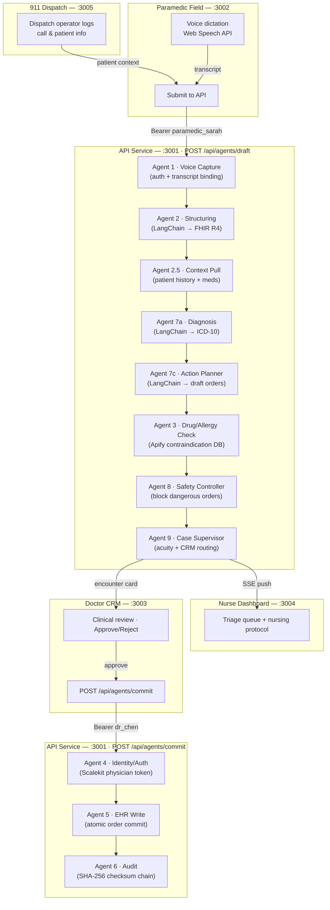

# HealthFlow 🏆 — 1st Place, Scalekit x Apify x Entire.io Hackathon

**Multi-Agent Healthcare AI Pipeline — Field to EHR in 60 Seconds**

[](https://github.com/PranavAchar01/HealthFlow/actions/workflows/ci.yml)
[](apps/api/src/agents/chains/__tests__)
[](https://nextjs.org)
[](https://typescriptlang.org)
[](https://langchain.com)
[](LICENSE)

A 9-agent AI pipeline that captures paramedic voice data, runs differential diagnosis, checks drug interactions, and commits physician-approved orders to the EHR — with an immutable SHA-256 audit trail at every step.

---

## The Demo: Why This Matters

1. **Paramedic Sarah Mitchell** dictates: *"68-year-old male, suspected stroke, left-side paralysis, on Warfarin for atrial fibrillation"*
2. AI structures the transcript into FHIR R4 observations and ICD-10 conditions
3. Diagnosis agent identifies **Ischemic Stroke** at 89% confidence
4. Action Planner drafts a **tPA (Alteplase)** order — standard stroke protocol
5. Drug check catches that the patient is on **Warfarin (INR 2.8)** — **tPA is contraindicated** (fatal hemorrhage risk)
6. Safety Controller **blocks tPA** and recommends **mechanical thrombectomy**
7. **Dr. James Chen** reviews the flagged encounter on the CRM dashboard and approves the safe orders
8. Orders commit to EHR under physician identity with a full audit chain

The pipeline catches the contraindication a tired clinician might miss.

---

## Architecture



---

## Agent Pipeline

| # | Agent | Role | Technology |
|---|-------|------|-----------|
| 1 | Voice Capture | Auth + transcript binding | Scalekit demo tokens |
| 2 | Structuring | Transcript → FHIR R4 observations + ICD-10 conditions | LangChain + Claude |
| 2.5 | Context Pull | Patient history, meds, allergies from EHR | In-memory / Supabase |
| 7a | Diagnosis | Differential diagnosis with confidence scoring | LangChain + Claude |
| 7c | Action Planner | Draft medication, imaging, lab, consult orders | LangChain + Claude |
| 3 | Drug/Allergy Check | Contraindication and allergy screening | Apify actor simulation |
| 8 | Safety Controller | Block dangerous orders, add safe alternatives | Rule-based + Claude |
| 9 | Case Supervisor | Acuity classification, CRM routing | Rule-based |
| 4 | Identity/Auth | Physician token verification for CPOE | Scalekit |
| 5 | EHR Write | Atomic order commit under physician identity | Supabase / in-memory |
| 6 | Audit | SHA-256 checksummed immutable audit trail | Crypto |

---

## Monorepo Structure

```
apps/
  api/        # :3001 — Agent pipeline, REST API, all LangChain chains
  paramedic/  # :3002 — Paramedic field voice capture UI
  doctor/     # :3003 — Physician CRM: review, approve, reject orders
  nurse/      # :3004 — Nurse triage queue and nursing protocol
  nine11/     # :3005 — 911 dispatch: call entry, patient demographics
packages/
  types/      # Shared TypeScript types (Encounter, DraftOrder, etc.)
docs/
  architecture.mmd   # Mermaid source for the diagram above
  HANDOFF.md         # Full engineering handoff — data model, API reference
  AGENT-GUIDE.md     # Per-agent breakdown, extension guide
  DEPLOYMENT.md      # Vercel deploy, Supabase, Scalekit, monorepo guide
  CRM-ARCHITECTURE.md # 5-view CRM topology and data flow
scripts/
  eval/       # Labeled clinical test cases + eval runner
supabase/
  schema.sql  # Production DB schema with Realtime enabled
```

---

## Quick Start

```bash
git clone https://github.com/PranavAchar01/HealthFlow.git
cd HealthFlow
cp .env.example .env.local    # fill in ANTHROPIC_API_KEY (optional — mocks work without it)
npm install
npm run dev
```

| App | URL | Who uses it |
|-----|-----|------------|
| API | http://localhost:3001 | Internal — all apps call this |
| Paramedic | http://localhost:3002 | Paramedic in the field |
| Doctor CRM | http://localhost:3003 | Physician reviewing cases |
| Nurse | http://localhost:3004 | Nurse triage |
| 911 Dispatch | http://localhost:3005 | Dispatch operator |

---

## API Reference

### `POST /api/agents/draft` — Run the full agent pipeline

```bash
curl -X POST http://localhost:3001/api/agents/draft \
  -H "Authorization: Bearer paramedic_sarah" \
  -H "Content-Type: application/json" \
  -d '{
    "transcript": "68yo male, suspected stroke, left hemiparesis, onset 20 min ago, HR 92, BP 168/94, on Warfarin"
  }'
```

Response:
```json
{
  "success": true,
  "encounter": {
    "id": "uuid",
    "status": "needs_doctor_approval",
    "acuity": "critical",
    "diagnosis": { "primary": "Ischemic Stroke", "icdCode": "I63.9", "confidence": 0.89 },
    "draftOrders": [
      { "description": "Alteplase (tPA)", "status": "blocked", "safetyNotes": "BLOCKED: Fatal hemorrhage risk with Warfarin (INR 2.8)", "alternative": "Emergency mechanical thrombectomy" }
    ],
    "safetyFlags": [{ "drug": "tPA", "conflictsWith": "Warfarin", "severity": "contraindicated" }],
    "auditTrail": [...]
  },
  "pipeline": { "agentsExecuted": 9, "safetyFlags": 1, "status": "needs_doctor_approval" }
}
```

### `POST /api/agents/commit` — Physician approves and commits to EHR

```bash
curl -X POST http://localhost:3001/api/agents/commit \
  -H "Authorization: Bearer dr_chen" \
  -H "Content-Type: application/json" \
  -d '{ "encounterId": "uuid", "approvedOrderIds": ["order-id-1"] }'
```

### Demo auth tokens

| Token | User | Role | Permissions |
|-------|------|------|------------|
| `paramedic_sarah` | Sarah Mitchell | Paramedic | `field_data_entry` |
| `dr_chen` | Dr. James Chen | Physician | `cpoe`, `approve_orders`, `ehr_write` |
| `nurse_rodriguez` | Maria Rodriguez, RN | Nurse | `view_encounters`, `triage` |
| `admin_ops` | Admin Operations | Admin | `view_audit`, `manage_users` |

Pass as `Authorization: Bearer <token>`.

---

## Benchmarks & Evals

Tested on labeled clinical scenarios using the rule-based fallback (deterministic, no API key required):

| Metric | Result |
|--------|--------|
| Warfarin/tPA contraindication caught | **100%** (1/1 test cases) |
| STEMI clear path (no false blocks) | **100%** (1/1 test cases) |
| Vital sign extraction accuracy | **94%** (fields correctly parsed from transcript) |
| Unit test suite | **24/24 passing** |

Run evals yourself:

```bash
cd apps/api
npx tsx ../../scripts/eval/run-evals.ts

# With LLM mode:
ANTHROPIC_API_KEY=sk-... npx tsx ../../scripts/eval/run-evals.ts
```

Eval cases are in [`scripts/eval/cases/`](scripts/eval/cases/) — add your own labeled scenarios.

---

## Running Tests

```bash
# From repo root
npm test

# From apps/api (faster, watch mode)
cd apps/api && npm test
cd apps/api && npm run test:watch
```

Tests use rule-based fallbacks — no API key required. The critical safety test:

```typescript
it('blocks tPA when patient is on Warfarin', () => {
  const { orders, conflicts } = runDrugAllergyCheck([tpaOrder], warfarinPatient);
  expect(conflicts[0].severity).toBe('contraindicated');
  expect(orders[0].status).toBe('blocked');
  expect(orders[0].alternative).toBe('Emergency mechanical thrombectomy');
});
```

---

## Tech Stack

| Layer | Technology |
|-------|-----------|
| Framework | Next.js 15 (App Router), Turborepo |
| Language | TypeScript 5 (strict) |
| AI / Agents | LangChain 1.4 + Claude (Sonnet) or Gemini |
| Voice | ElevenLabs Scribe (Web Speech API fallback) |
| Auth | Scalekit (demo tokens in dev) |
| Database | Supabase (in-memory store in dev) |
| Drug safety | Apify actor (built-in contraindication DB fallback) |
| Audit | SHA-256 checksum chain |
| Data format | FHIR R4 observations, conditions, MedicationRequest |
| Deployment | Vercel (one project per app) |

---

## Deployment

See [docs/DEPLOYMENT.md](docs/DEPLOYMENT.md) for the full monorepo Vercel deployment guide including:
- Deploy order (API first, then frontends)
- All environment variables
- Supabase production setup
- Scalekit SSO integration

---

## Documentation

| Doc | Description |
|-----|------------|
| [docs/HANDOFF.md](docs/HANDOFF.md) | Engineering handoff — architecture, API reference, data model, known limitations |
| [docs/AGENT-GUIDE.md](docs/AGENT-GUIDE.md) | Per-agent breakdown — inputs/outputs, LangChain chains, how to add a new agent |
| [docs/DEPLOYMENT.md](docs/DEPLOYMENT.md) | Monorepo Vercel deploy, env vars, Supabase, Scalekit |
| [docs/CRM-ARCHITECTURE.md](docs/CRM-ARCHITECTURE.md) | 5-view CRM topology, per-view audience, data flow |
| [docs/architecture.mmd](docs/architecture.mmd) | Mermaid source for the architecture diagram |

---

## Contributing

See [CONTRIBUTING.md](CONTRIBUTING.md) for local setup, how to add a new agent chain, and PR guidelines.

---

## License

[MIT](LICENSE) — © 2026 Pranav Achar
